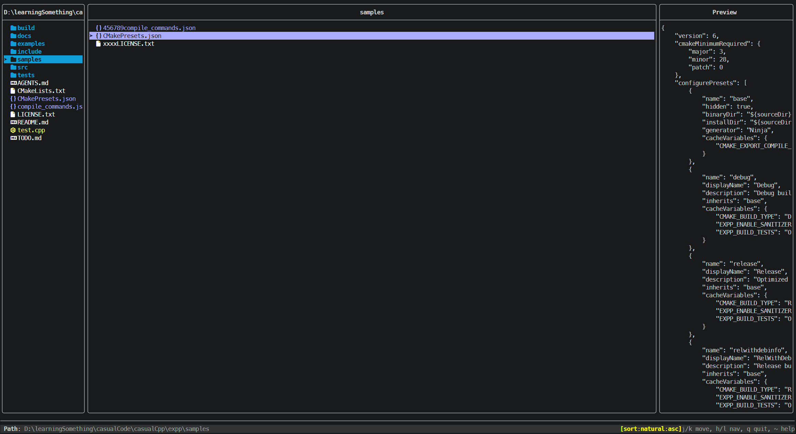

# Expp

Expp is a cross-platform terminal user interface (TUI) file manager built with C++23.

It is designed for fast navigation and editing workflows inspired by modal editors while keeping a modern, testable architecture:

- Core: filesystem, config, runtime, error model
- App: command semantics, state transitions, orchestration
- UI: rendering, key handling, help overlay, theme

The project targets performance and maintainability for very large directories, with strict compiler warnings, sanitizer-friendly builds, and layered error handling based on expected-style results.

## Appearance



## Highlights

- Vim-like navigation and visual selection
- Copy/cut/paste workflows with overwrite support
- Trash and permanent delete operations
- Search, hidden-file toggle, and multiple sort modes
- Built-in help overlay with filtering
- TOML-driven configuration (theme, icons, behavior, layout)
- Cross-platform build system with CMake presets
- Unit tests with Catch2

## Quick Keybindings

Navigation:

- `j` / `k`: move down/up
- `h` / `l` or arrow keys: parent / enter
- `gg` / `G`: top / bottom
- `C-d` / `C-u`: page down/up
- `gh`: go home
- `gc`: go config directory
- `g:`: directory jump prompt

File operations:

- `a`: create
- `r`: rename
- `y` / `x`: yank(copy) / cut
- `Y` / `X`: clear clipboard
- `p` / `P`: paste / paste with overwrite
- `d` / `D`: move to trash / permanent delete

Search and view:

- `/`: search
- `n` / `N`: next / previous match
- `\\`: clear search highlights
- `.`: toggle hidden files
- `,m ,b ,e ,a ,n ,s`: sort by modified/birth/ext/alpha/natural/size
- Uppercase sort key toggles descending order (for example `,M`)

Help and app:

- `~`: open help overlay
- `q` or `Esc`: quit

## Download Prebuilt Binary (GitHub Releases)

If you just want to run Expp, use a release build from GitHub:

1. Open the Releases page:
	- Latest release: https://github.com/Mintinson/expp/releases/latest
	- All releases: https://github.com/Mintinson/expp/releases
2. In **Assets**, download the package matching your OS/CPU.
3. Extract the archive (if needed).
4. Run the binary:
	- Windows: `explorer.exe`
	- Linux/macOS: `explorer`

If a release for your platform is not available yet, build from source (next section).

## Build From Source

### Prerequisites

- CMake 3.28+
- Ninja (recommended generator used by presets)
- A C++23-capable compiler:
  - MSVC 17.12+
  - GCC 15+
  - Clang 20+
- Git

Optional:

- `libmagic` for MIME sniffing (when available)

Dependencies such as FTXUI, toml++, Catch2, and Asio are fetched automatically by CMake.

### Build Using Presets (Recommended)

#### Windows (MSVC Release)

```powershell
cmake --preset msvc-release
cmake --build build/msvc-release
```

Binary location:

`build/msvc-release/explorer.exe`

#### Linux/macOS (Release)

```bash
cmake --preset release
cmake --build --preset release
```

Binary location:

`build/release/explorer`

### Other Useful Presets

- `debug`: debug build with tests and sanitizers enabled
- `asan`: sanitizer-focused build
- `relwithdebinfo`: optimized build with debug symbols
- `clang-tidy`: enable clang-tidy checks

Inspect available presets:

```bash
cmake --list-presets
```

## Run

From the build output directory:

```bash
./explorer
```

Or start from a specific directory:

```bash
./explorer /path/to/start-directory
```

On Windows PowerShell:

```powershell
.\explorer.exe
.\explorer.exe D:\path\to\start-directory
```

## Test

Build a test-enabled preset first (for example `debug`), then run:

```bash
ctest --preset debug --output-on-failure
```

Or use the custom test target:

```bash
cmake --build build/debug --target run_tests
```

## Configuration

Expp loads configuration from standard locations. Typical user config paths:

- Linux/macOS: `~/.config/expp/config.toml`
- Windows: `%APPDATA%\expp\config.toml`

Minimal example:

```toml
[behavior]
showHiddenFiles = false

[preview]
enabled = true
maxLines = 50

[layout]
showPreviewPanel = true
showParentPanel = true
```

## Project Structure

```text
include/expp/      # Public headers
src/core/          # Core capabilities
src/app/           # Domain/application logic
src/ui/            # TUI and interaction layer
tests/             # Unit tests
docs/              # Architecture and deep-dive docs
assets/            # Images and resources
```

## Documentation

Detailed architecture and module docs are available in `docs/` (Chinese), including:

- Architecture overview
- Core/App/UI module deep dives
- Dataflow and sequence diagrams
- Testing and quality notes
- Optimization roadmap

Entry point:

- `docs/00-文档.md`

## License

Licensed under the terms in `LICENSE.txt`.
